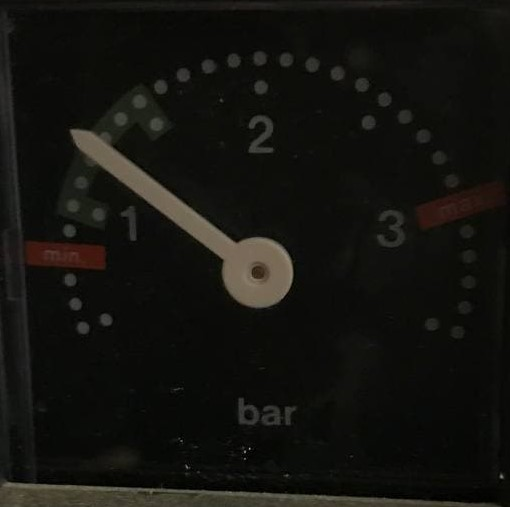
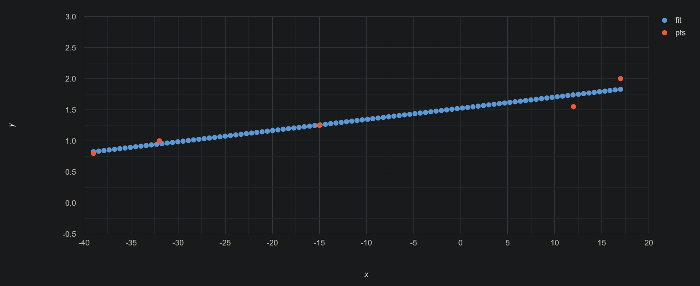
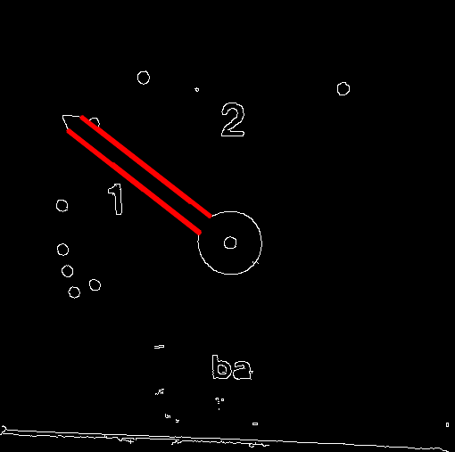
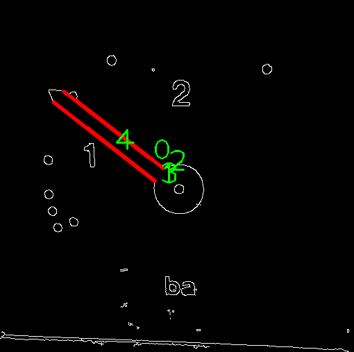

# Analog Gauge Reader

This is a python application which takes an image or video frame of an analog gauge as an input and reads the value using the [OpenCV](https://opencv.org/) Computer Vision library.

## Calibration

To convert the calculated angels of the detected lines we need some reference angels and their associated values.
You can find the example images used to calibrate our gauge reader in the [gauge_images](gauge_images) directory. 



*Example Gauge showing ~1.25 bar*

In the following table you can see the detected angels and the respective estimated value of the gauge:

| detected angle | estimated value (bar) |
|:--------------:|:----------------------:|
| -15°           | 1.25                   |
| -32°           | 1                      |
| 17°            | 2                      |
| -39°           | 0.8                    |
| 12°            | 1.5                    |

Using a affine / linear curve fitting equation finding method we can estimate the following mathematic equation from it:

`f(x) ≈ 0.0179735x + 1.5249`



*Plot corresponding fitting curve*

See https://www.dcode.fr/function-equation-finder for more information on how to find a affine / linear curve fitting equation 

## Measurement

First, we perform edge detection with the [Canny edge detector](https://en.wikipedia.org/wiki/Canny_edge_detector) algorithm implementation from OpenCV.
After that we can use OpenCV's implementation of the [probabilistic Hough transform](https://en.wikipedia.org/wiki/Randomized_Hough_transform) algorithm `HoughLinesP` to detect lines in the previosly processed image.
This will then look like this:



At first glance, it looks like there are two clear lines on the image. Only at a closer look you can see that they are four lines, which were recognized by the alrogithm. 
For a better representation, numbers are attached to the respective lines in the following picture.



For measurement of the angle of the lines, we use the `atan2` [function](https://en.wikipedia.org/wiki/Atan2), which is an extended version of the trigonometric inverse tangent function.
With that function we calculate the angles between all the vectors that make up the lines and take the average of them.
This value is then substituted  into our equation described above (`f(x) ≈ 0.0179735x + 1.5249`) to obtain the desired pressure value in bar.

### Example

In the image above, the algorithm detects an average angle of -15°. If we put this into our equation we will end up with the following:

```
f(x) ≈ 0.0179735x + 1.5249
f(x) = 0.0179735 * -15 + 1.5249
f(x) = 1.2552975 bar
```

As we can see in the example gauge image, this value is almost 100% accurate.

## Todo

- Prometheus Integration to show values in Grafana Dashboards and add alerts for certain tresholds
- Add support for periodically checking camera / video input

## About

See https://docs.opencv.org/3.4/d9/db0/tutorial_hough_lines.html for more information about the OpenCV Hough Line Transform.
